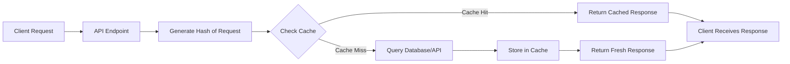
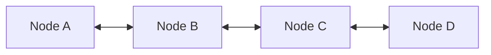

# Lru-Cache

Cache systems such as Redis are used to temporarily store frequently accessed data in memory, in order to reduce latency and improve application performance. Since memory is limited, it's essential to manage which data stays in the cache and which gets removed when space runs out.

One popular strategy for this is LRU

1. ### What is LRU ?

LRU stands for Least Recently Used

The LRU eviction policy automatically removes the least recently accessed items from the cache to make room for new data. This approach assumes that recently used data is more likely to be used again soon, while older data can be safely discarded.

For example, Redis supports LRU as one of its eviction policies. It keeps track of access patterns and evicts the least recently used keys when the cache reaches its memory limit. This makes Redis efficient and suitable for high-performance applications that need intelligent memory management.

Here is a simple presentation of how cache works:



2. ### Implementation

To efficiently implement LRU, systems often use:

- Doubly Linked List: to keep track of access order (most recent at one end, least recent at the other).

- Hash Map: for quick lookup of keys.

The Doubly Linked List can be represented like this:



Each node knows his previous and next one.

For example:

Suppose you want to cache API requests to fetch details about a specific user.
Each user is identified by their email address.
You compute a hash of the email address, which is used as the cache key.
The value stored in the cache is a Node, which contains:

- The original hash as the key

- The API response (usually as a stringified JSON) as the value.
This allows you to quickly retrieve user data without querying the database repeatedly.

Then this Node is stored in a Map to facilitate the direct access O(1)

3. ### Code Explanation
To make the understanding more simple we gonna use a simple implementation.

We want to store simple value like [1,1] or [2,2] or [2,3] etc...

→ **First you implement the Node class:**

```
public class Node {

    int key;
    int val;
    Node prev, next;
    public Node(int key, int val) {
        this.key = key;
        this.val = val;
    }
}
```
Inside the Node class you define his value, and the previous and next node attributes.

Let's start to implement the LRU Cache now step by step.

→ **Then implement the class:**
```
public class LruCache {

    int maxSize;
    Map<Integer, Node> cacheObject;
    Node head;
    Node tail;

    public LruCache(int maxSize) {
        this.maxSize = maxSize;
        head = new Node(0, 0);
        tail = new Node(0, 0);
        head.next = tail;
        tail.prev = head;
        cacheObject = new HashMap<>();
    }
}
```
LruCache is a fixed-capacity cache that evicts the least recently used items when full. It combines a doubly linked list and a hashmap to provide O(1) time complexity for both get and put operations.

- maxSize: Maximum number of items the cache can hold.
- cacheObject: HashMap for fast key-to-node lookup.
- head & tail: Sentinel nodes to manage the doubly linked list representing usage order.

The constructor initializes the cache with the given capacity and sets up an empty doubly linked list.

→ **Now implement the getter:**

```
    int get(int key) {
        if (cacheObject.containsKey(key)) {
            Node node = cacheObject.get(key);
            return node.val;
        }
        return -1;
    }
```

Retrieves the value associated with the specified key from the cache.

- If the key exists, returns its corresponding value.
- If the key does not exist, returns -1.

This operation runs in O(1) time due to the underlying hashmap.

→ **Implement the setter:**

Inserts or updates a key-value pair in the LRU cache.

- If the key already exists:
   - Removes the old node from the usage list.
   - Inserts the new node at the front (most recently used).
   - Updates the map entry.

- If the key is new:
   - If the cache has reached its capacity:
     - Evicts the least recently used node.
     - Removes its entry from the map.

   - Adds the new node to the front and stores it in the map.

This operation ensures O(1) time complexity for both insertion and eviction, using a combination of a hashmap and a doubly-linked list.

→ **Add a new node to the Doubly Linked List:**

```
private void addToFront(Node node) {
        node.prev = tail.prev;
        node.next = tail;
        tail.prev.next = node;
        tail.prev = node;
    }
```

Adds a given node to the most recently used (MRU) position in the doubly linked list — right before the tail node.

Why?

In an LRU (Least Recently Used) cache, the most recently accessed or inserted node should be placed at the end (just before the tail), while the least recently used node sits at the beginning (right after the head). This helps manage eviction order efficiently.

→ **Remove a node:**

```
private void remove(Node node) {
    node.detachNode();
}

```

```
public void detachNode() {
    if (prev != null) {
        prev.next = next;
    }
    if (next != null) {
        next.prev = prev;
    }
    prev = null;
    next = null;
}
```
The remove(Node node) method removes a node from the doubly linked list.

Internally, it calls the detachNode() method defined in the Node class.

detachNode() re-links the surrounding nodes by bypassing the target node, effectively removing it from the list.

After re-linking, it nullifies the prev and next pointers of the node to fully detach it and help with garbage collection.

Before removal:
```
A <-> B <-> C
       ↑
     (node to remove)
```
After removal:
```
A <-> C
```
This operation is essential for maintaining the correct order in the LRU cache, especially when:

- Moving a node to the front (most recently used).

- Evicting the least recently used node from the head.

→ **Evict the last recently:**

```
private Node evictLastRecently() {
    Node nodeToEvict = head.next;
    if (nodeToEvict != null && nodeToEvict != tail) {
        remove(nodeToEvict);
    }
    return nodeToEvict;
}
```

This method evicts the least recently used node from the cache.

The least recently used node is always right after the head of the doubly linked list.

It checks that the node to evict is not null and is not the tail (guard condition).

Then it removes that node from the linked list using the remove method.

Finally, it returns the evicted node so the cache map can remove it by key.

Before eviction:
```
head <-> A <-> B <-> C <-> tail
        ↑
   (Least Recently Used)
```

After eviction:
```
head <-> B <-> C <-> tail
```

4. ### Conclusion
The LRU Cache (Least Recently Used) is an efficient data structure that combines a HashMap and a Doubly Linked List to achieve constant time complexity O(1) for both get and put operations.
It ensures that the most recently accessed items stay available, while the least recently used ones are automatically evicted when capacity is reached.

This design is ideal for caching scenarios where speed and memory efficiency are critical — such as in web caching, memory paging, or database indexing.


Congrats, now you have an idea of what a LRU is and his purpose !